# Práctico 2 - Desarollo de Software Seguro

## Detección de Vulnerabilidades:

### 1. Inyección SQL (sqli)
Esta vulnerabilidad se encontraba en el backend; archivo invoiceService.ts en la línea 19 donde decía esto:

    if (status) q = q.andWhereRaw(" status "+ operator + " '"+ status +"'");

El flujo de la vulnerabilidad empieza en invoiceController.ts en las lineas 7-8:

    const state = req.query.status as string | undefined;
    const operator = req.query.operator as string | undefined;

Aquí entran los parámetros y se pasan directamente al servicio sin validación.
Un atacante puede venir y directamente desde el navegador, poner un URL malicioso como por ejemplo:

"_https://tuapp.com/invoices?status=paid'%20OR%201=1%20--%20&operator==_"

El %20 es espacio y -- es comentario SQL, entonces si eso lo convertimos queda como **status = "paid' OR 1=1 -- "** lo que significa que primero cierra la cadena original, y depsués manda una condición que siempre va dar true, mientras commenta el resto de la consulta.Esto hace que después el atacante obtenga _todas_ las facturas de _todos_ los usuarios.

Después de corregirlo, se modifiqué el archivo invoiceService.test.ts poniéndo esta línea de código donde confirma que la validación funciona.

    await expect(InvoiceService.list(userId, maliciousState, operator)).rejects.toThrow('Invalid operator');

---
### 2. Credenciales embebidas (Hard Coded Credentials)

Esta vulnerabilidad estaba en el archivo auth.middleware.ts:

    const decoded = jwt.verify(token, "secreto_super_seguro");

En este caso, un atacante puede acceder al repositorio/despliegue donde el código está disponible y leer la clave secreta. Después puede crear un token jwt falso y lo firma usando la clave; despupes envía el token al backend, específicamente en el header (_Authorization: Bearer <token_falso>_) y le da acceso como si fuera el usuario del payload.

Para mitigarlo modifiqué el código para que la clave secreta la tome desde una variable de entorno que está creada en .env en el backend. Ahora sí la clave ya no está expuesta.

Lo probé en Postman para verificar que estuviera andando con un POST /auth/login y un GET /invoices:

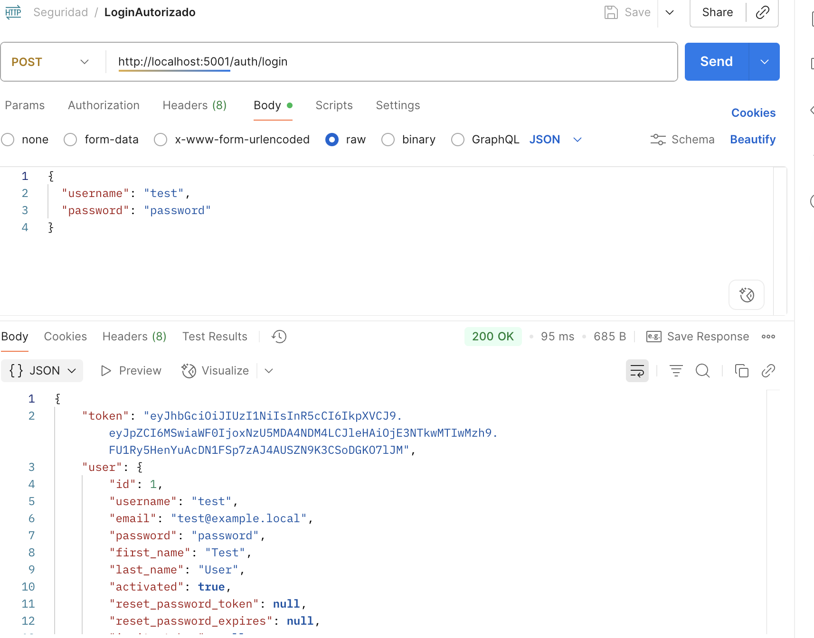

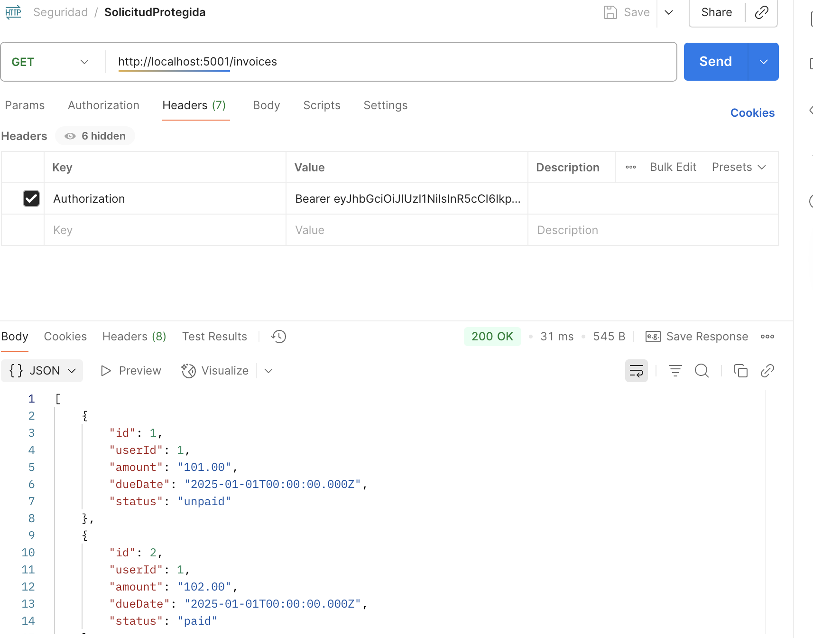

---
### 3. Falsificación de Peticiones del Lado del Servidor (Server Side Request Fogery - SSRF)

En el método setPaymentCard de invoiceService.ts se ubica esta vulnerabilidad:

    const paymentResponse = await axios.post(`http://${paymentBrand}/payments`, {
    ccNumber,
    ccv,
    expirationDate
    });

Esto es porque el parámetro paymentBrand viene de la solicitud del usuario y se usa directamente para construir una URL externa. Un atacante puede manipular este valor para hacer que el backend realice solicitudes a cualquier servidor.

Para explotar la vulnerabilidad primero se hace una solicitud al endpoint de pago y en el body se pone un valor malicioso:

    paymentBrand: "localhost:5001"

El backend construirá la URL:

    http://localhost:5001/payments

Y hará una solicitud POST con los datos de la tarjeta.

Hice un ejemplo de explotación donde el backend intentó conectarse a la dirección que puse en el campo (en este caso 127.0.0.1:5001).

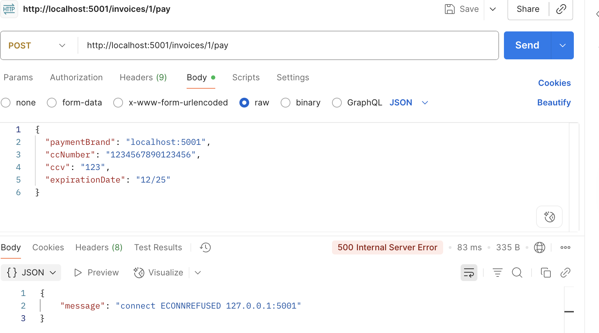

Ahora que lo mitigué editanto el archivo paymentBrand:

    const allowedBrands = ['visa', 'mastercard', 'amex'];
    if (!allowedBrands.includes(paymentBrand)) {
    throw new Error('Invalid payment brand');
    }

Si el valor no está en la lista, el backend rechaza la solicitud y no intenta conectarse a la URL que le da el usuario.

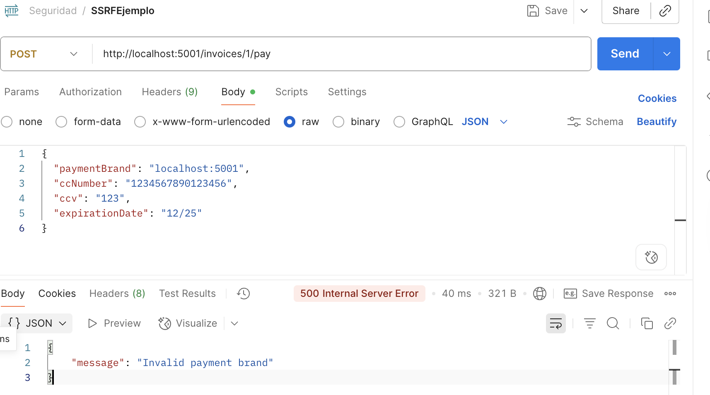

---
### 4. Recorrido de directorios (Path Traversal)

Esta vulnerabilidad está en el método getReceipt del archivo invoiceService.ts:

    const filePath = `/invoices/${pdfName}`;
    const content = await fs.readFile(filePath, 'utf-8');

En el parámetro pdfName viene directamente la solicitud del usuario y se usa para construir la ruta del archivo sin validación alguna.

Para explotar esta vulnerabilidad primero se hace una solicitud al endpoint que llama ese método, y luego en el parámetro pdfName le ingresas un valor malicioso: **../../../../etc/passwd**. 

El backend va a construir la ruta y tratará de leer el archivo y terminará devolviendo lo que le pidieron; dejando que el atacante pueda acceder a archivos sensibles.

Hice una prueba con postman para verificarlo:

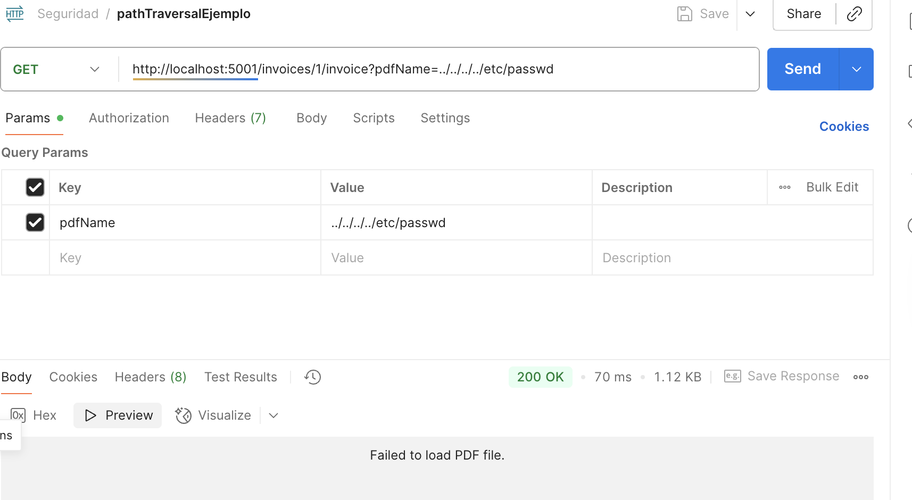

El backend respondió **200 OK** y trató de devolver el contenido de passwd, aunque postman no pudo mostrarlo como pdf.

Para mitigarlo primero agregué una validación para que solo se acepten nombres de archivos seguros y que terminen en .pdf y después con con un path.join verifiqué que el archivo esté dentro de lo permitido.

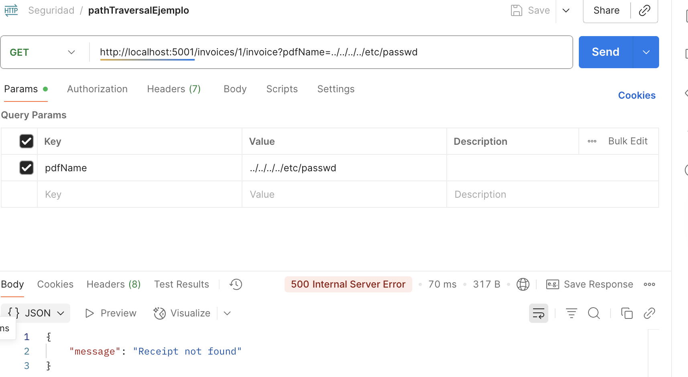

---
### 5. Falta de autorización (Missing Authorization)

Estan en las rutas del usuario: user.routes.ts:

    router.post('/', routes.createUser);
    router.put('/:id', routes.updateUser);

Estas rutas no tienen ningún middleware de autentiación ni autorización lo que significa que cualquier usuario (incluso sin estar autenticado) puede crear o modificar usuarios.

Para explotarla primero haces una solicitud POST a users con datos de usuario, sin enviar ningún token de autenticacion; el backend creará el usuario de igual forma. Después haces una solicitud PUT a /users/:id con datos modificados sin enviar token y el backend actualiza el usuario aunque no tengas permisos para hacerlo.

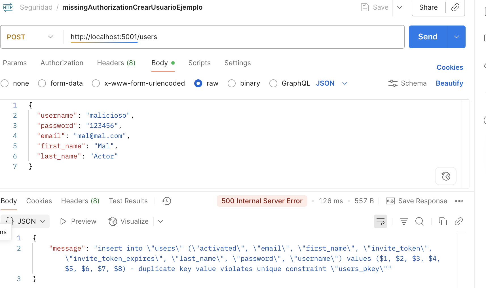

El error que se muestra es que el email/nombre ya existe pero ta lo importante es que el backend procesó la solicitud sin requerir autenticación ni autorización.

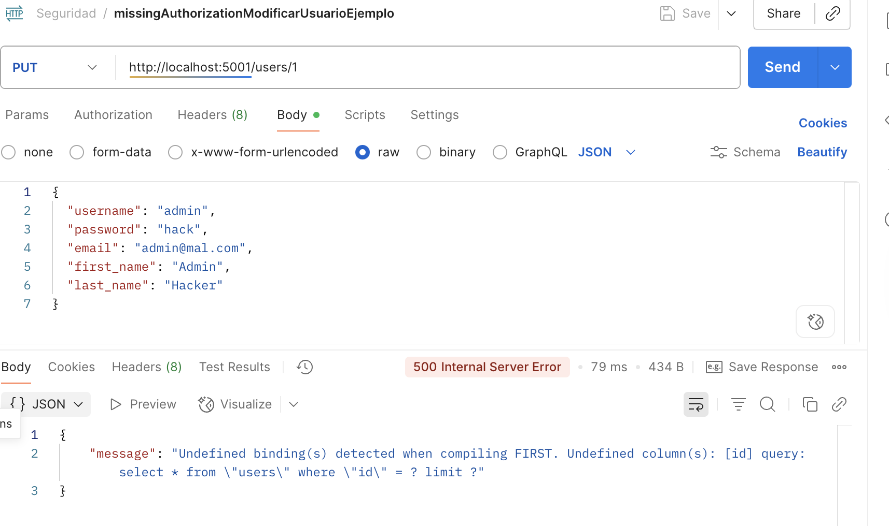

Ahora para mitigarlo, agregué el middleware de autenticación a esas rutas:

    router.post('/', authMiddleware, routes.createUser);
    router.put('/:id', authMiddleware, routes.updateUser);

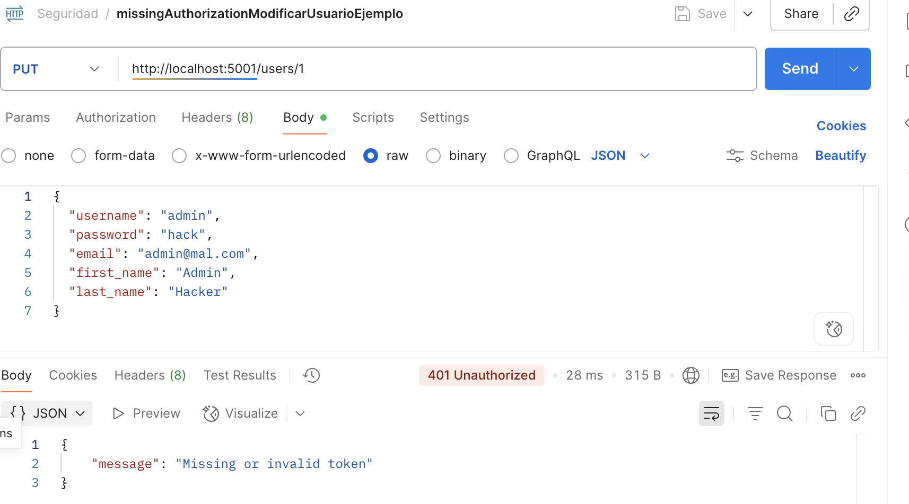

Pero si pongo la autorización con el token, sí me deja.

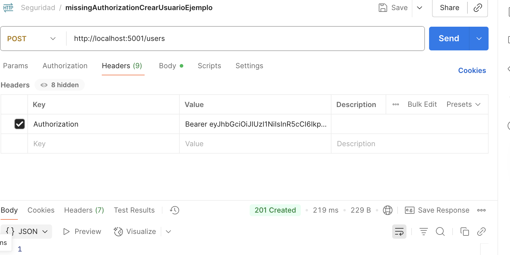

---
### 6. Inyección de comandos en plantillas (Template Command Injection)

Esta vulnerabilidad está en authService.ts:

    const template = `
    <html>
        <body>
        <h1>Hello ${user.first_name} ${user.last_name}</h1>
        
Click <a href="${ link }">here</a> to activate your account.

        </body>
    </html>`;
    const htmlBody = ejs.render(template);

Los valores user.first_name, user.last_name y link vienen de datos de usuario y se intercalan directamente en la plantilla.

Para explotarla primero te registrar o creas un usuario con un nombre malicioso, el backend genera el email usando esos valores y cuando el destinatario abre el mail, el código malicioso se ejecuta en su navegador; con esto se logra un ataque XSS o manipulación del contenido del mail.

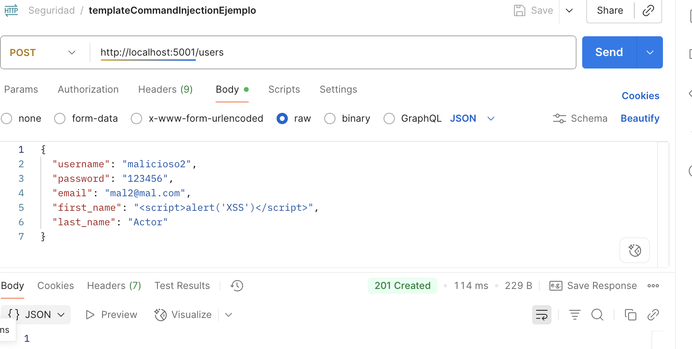

Ahora reemplacé los caracters <, >, &, ", ', por sus entidades html y se usa ejs para renderizar la plantilla:

    const htmlBody = ejs.render(template, {
    firstName: escapeHtml(user.first_name),
    lastName: escapeHtml(user.last_name),
    link: link
    });

Ahora al mitigarlo, me sigue dejando crear los usuarios, porque no bloquea la creación de usuarios, sino que evita que el código malicioso se ejecute en la plantilla del email. Entonces aunque cree un usuario con datos como los que puse anteriormente, convierte los caracteres en texto seguro antes de renderizar el mail; el usuario se crea pero el codigo malicioso no se ejecuta en el mail.

Para revisar el mail abrí Mailhod con el mail y usuario que cree y confirma que la mitigación anda.:

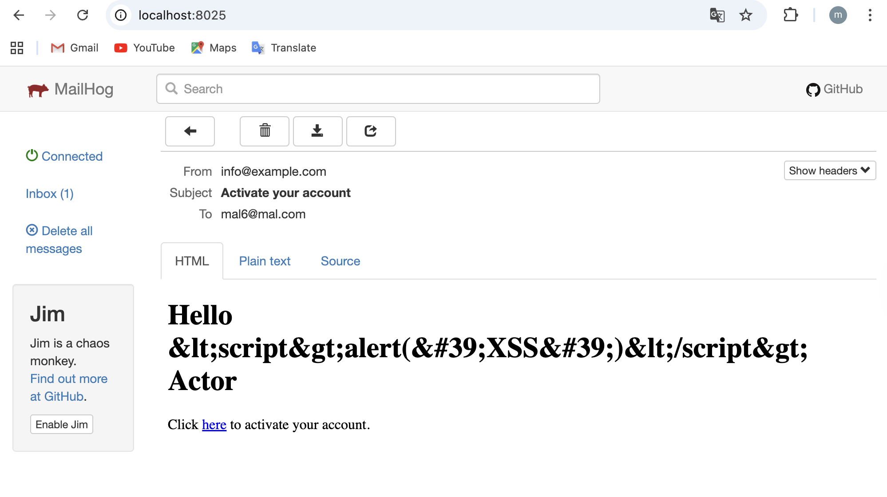

---
### 7. Almacenamiento inseguro

La ubicación del problema está en el archivo authService.ts; la contraseña del usuario se almacena directamente:

    await db<UserRow>('users')
    .insert({
        username: user.username,
        password: user.password, // <-- aquí está el problema
        ...
    });

Y en la autenticación:

    if (password != user.password) throw new Error('Invalid password');

Esto hace que las contraseñas se guarden en texto plano en la db.

Para explotar la vulnerabilidad, un atacante que obtenga acceso a la base de datos (por ejemplo mediante sql injection, y así) podrá ver las contraseñas de los usuarios, incluso no necesita ningún dato especial para explotarla, solo acceso a la tabla **users**.

Con tan solo ejecutar una consulta sql como: _SELECT username, password FROM users;_ esto revelará todas las contraseñas sin ser protegidas.

En este caso como no hay ninguna base de datos no se puede probar explotar la vulnerabilidad, pero lo corrijo igual.

Para mitigarla hice que las contraseñas se almacenen y comparen usando bycrypt(que las hashea y compara las hasheadas y hay que hacer un **npm install bcryptjs**).

En la funcion createUser:
    const hashedPassword = await bcrypt.hash(user.password, 12);
    await db<UserRow>('users')
    .insert({
        username: user.username,
        password: hashedPassword, // ← mitigación
        ...
    });

En la función updateUser:

    const hashedPassword = await bcrypt.hash(user.password, 12);
    await db<UserRow>('users')
    .where({ id: user.id })
    .update({
        password: hashedPassword, // ← mitigación
        ...
    });

En la función authenticate:
    const valid = await bcrypt.compare(password, user.password); // ← mitigación
    if (!valid) throw new Error('Invalid password');

Y depsués importé el bcryptjs.